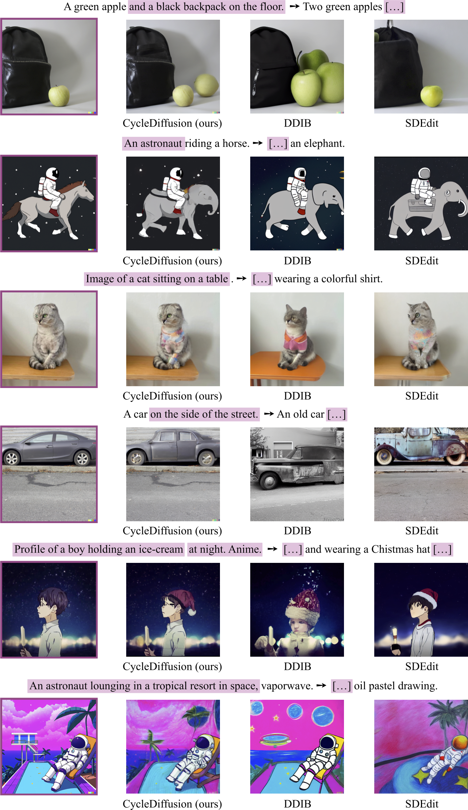

# CycleDiffusion: Text-to-Image Diffusion Models Are Image-to-Image Editors via Inferring "Random Seed"

Official PyTorch implementation of (**Sections 4.1** and **4.2** of) our paper <br>
**Unifying Diffusion Models' Latent Space, with Applications to CycleDiffusion and Guidance** <br>
Chen Henry Wu, Fernando De la Torre <br>
Carnegie Mellon University <br>
_Preprint, Oct 2022_


[**[Paper link]**](https://arxiv.org/abs/2210.05559) | [**[Diffusers 🧨 implementation]**](https://huggingface.co/docs/diffusers/main/en/api/pipelines/cycle_diffusion) | [**[HuggingFace 🤗 demo]**](https://huggingface.co/spaces/ChenWu98/Stable-CycleDiffusion)

## Updates
**[Oct 13 2022]** Code released.

**[Oct 16 2022]** Updated [customized use](#customized-use-for-zero-shot-image-to-image-translation) for zero-shot image editing.

**[Nov 9 2022]** CycleDiffusion is now available as a pipeline on HuggingFace 🤗 [Diffusers](https://github.com/huggingface/diffusers) 🧨. Please check the [pipeline doc](https://huggingface.co/docs/diffusers/main/en/api/pipelines/cycle_diffusion). The CycleDiffusion pipeline supports [Cross Attention Control](https://arxiv.org/abs/2208.01626) (CAC). 

**[Nov 10 2022]** A demo built with HuggingFace 🤗 Spaces is available at [Stable CycleDiffusion](https://huggingface.co/spaces/ChenWu98/Stable-CycleDiffusion). CAC is supported. 


## Notes
1. **Section 4.3** of this paper is open-sourced at [Unified Generative Zoo](https://github.com/ChenWu98/unified-generative-zoo).
2. The code is based on [Generative Visual Prompt](https://github.com/ChenWu98/Generative-Visual-Prompt).
3. Feel free to email me if you think I should cite your work! 

## Overview
We think the randomness in diffusion models is like magic! Accumulated evidence has shown that fixing the "random seed" helps diffusion models generate images from two image distributions with minimal differences. Our paper is exactly about **how to formalize this "random seed"** and **how to infer it from a given real image**. 

Our formalization and derivation are purely by definition, while we show that some amazing consequences follow! This repository contains code for **CycleDiffusion**, an embarrassingly simple method capable of

1. Zero-shot image-to-image translation with text-to-image diffusion models such as Stable Diffusion. 
2. Traditional unpaired image-to-image translation with diffusion models trained on two related domains.

Check our results on zero-shot image-to-image translation below! We formulate the task input as a triplet $(\boldsymbol{x}, \boldsymbol{t}, \hat{\boldsymbol{t}})$:

1. $\boldsymbol{x}$ is the source image, displayed with a purple margin.
2. $\boldsymbol{t}$ is the source text, with text spans marked in purple.
3. $\hat{\boldsymbol{t}}$ is the target text, with text spans abbreviated as $[\ldots]$ if overlapped with the source text.

We used [Stable Diffusion](https://github.com/CompVis/stable-diffusion) in our experiments. Notably, all source images $\boldsymbol{x}$ are **real images**! Yes, you find that some of them are generated by DALL∙E 2, but these images can be seen as **real** for Stable Diffusion :) 

<div align=center>
    
</div>

<br>

Here are some comparisons with baselines. 

<div align=center>
    
</div>

## Contents
- [CycleDiffusion: Text-to-Image Diffusion Models Are Image-to-Image Editors via Inferring "Random Seed"](#cyclediffusion-text-to-image-diffusion-models-are-image-to-image-editors-via-inferring-random-seed)
  - [Updates](#updates)
  - [TODOs](#todos)
  - [Notes](#notes)
  - [Overview](#overview)
  - [Contents](#contents)
  - [Dependencies](#dependencies)
  - [Evaluation data](#evaluation-data)
  - [Pre-trained diffusion models](#pre-trained-diffusion-models)
  - [Usage](#usage)
    - [Zero-shot image-to-image translation with text-to-image diffusion models](#zero-shot-image-to-image-translation-with-text-to-image-diffusion-models)
    - [Customized use for zero-shot image-to-image translation](#customized-use-for-zero-shot-image-to-image-translation)
    - [Unpaired image-to-image translation with diffusion models trained on two domains](#unpaired-image-to-image-translation-with-diffusion-models-trained-on-two-domains)
  - [Citation](#citation)
  - [Potential Societal Impact](#potential-societal-impact)
  - [License](#license)
  - [Contact](#contact)


## Dependencies

1. Create environment by running
```shell
conda env create -f environment.yml
conda activate generative_prompt
pip install git+https://github.com/openai/CLIP.git
```
2. Install `torch` and `torchvision` based on your CUDA version. 
3. Install [taming-transformers](https://github.com/CompVis/taming-transformers) by running
```shell
cd ../
git clone git@github.com:CompVis/taming-transformers.git
cd taming-transformers/
pip install -e .
cd ../
```
4. Set up [wandb](https://wandb.ai/) for logging (registration is required). You should modify the ```setup_wandb``` function in ```main.py``` to accomodate your wandb credentials. You may want to run something like
```shell
wandb login
```

## Evaluation data

1. Most data for zero-shot image-to-image translation are already included in [data/](data/). Some images are from the AFHQ validation set, detailed below. 
2. Prepare the AFHQ validation set for unpaired image-to-image translation (also for some images used by zero-shot image-to-image translation) by running
```shell
git clone git@github.com:clovaai/stargan-v2.git
cd stargan-v2/
bash download.sh afhq-v2-dataset
```

## Pre-trained diffusion models

1. Stable Diffusion
```shell
cd ckpts/
mkdir stable_diffusion
cd stable_diffusion/
# Download pre-trained checkpoints for Stable Diffusion here.
# You should download this version: https://huggingface.co/CompVis/stable-diffusion-v-1-4-original
# Due to licence issues, we cannot share the pre-trained checkpoints directly.
```
2. Latent Diffusion Model
```shell
cd ckpts/
wget https://www.dropbox.com/s/9lpdgs83l7tjk6c/ldm_models.zip
unzip ldm_models.zip
cd ldm_models/
mkdir text2img-large
cd text2img-large/
wget https://ommer-lab.com/files/latent-diffusion/nitro/txt2img-f8-large/model.ckpt
wget https://www.dropbox.com/s/7pdttimz78ll0km/txt2img-1p4B-eval.yaml
```
3. DDPM (AFHQ-Dog and FFHQ are from ILVR; CelebAHQ is from SDEdit; AFHQ-Cat and -Wild are trained by ourselves)
```shell
cd ckpts/
mkdir ddpm
cd ddpm/
wget https://image-editing-test-12345.s3-us-west-2.amazonaws.com/checkpoints/celeba_hq.ckpt
wget https://www.dropbox.com/s/g4h8sv07i3hj83d/ffhq_10m.pt
wget https://www.dropbox.com/s/u74w8vaw1f8lc4k/afhq_dog_4m.pt
wget https://www.dropbox.com/s/8i5aznjwdl3b5iq/cat_ema_0.9999_050000.pt
wget https://www.dropbox.com/s/tplximipy8zxaub/wild_ema_0.9999_050000.pt
wget https://www.dropbox.com/s/vqm6bxj0zslrjxv/configs.zip
unzip configs.zip
```

## Usage

### Zero-shot image-to-image translation with text-to-image diffusion models
1. Zero-shot image-to-image translation with Stable Diffusion v1-4. We divided the 128 test samples into 8 groups (16 samples in each group), so the averaged metrics are reported. 
```shell
export CUDA_VISIBLE_DEVICES=0
export RUN_NAME=translate_text2img256_stable_diffusion_stochastic_1
export SEED=42
nohup python -m torch.distributed.launch --nproc_per_node 1 --master_port 1405 main.py --seed $SEED --cfg experiments/$RUN_NAME.cfg --run_name $RUN_NAME$SEED --logging_strategy steps --logging_first_step true --logging_steps 4 --evaluation_strategy steps --eval_steps 50 --metric_for_best_model CLIPEnergy --greater_is_better false --save_strategy steps --save_steps 50 --save_total_limit 1 --load_best_model_at_end --gradient_accumulation_steps 4 --num_train_epochs 0 --adafactor false --learning_rate 1e-3 --do_eval --output_dir output/$RUN_NAME$SEED --overwrite_output_dir --per_device_train_batch_size 1 --per_device_eval_batch_size 4 --eval_accumulation_steps 4 --ddp_find_unused_parameters true --verbose true > $RUN_NAME$SEED.log 2>&1 &

export CUDA_VISIBLE_DEVICES=1
export RUN_NAME=translate_text2img256_stable_diffusion_stochastic_2
export SEED=42
nohup python -m torch.distributed.launch --nproc_per_node 1 --master_port 1424 main.py --seed $SEED --cfg experiments/$RUN_NAME.cfg --run_name $RUN_NAME$SEED --logging_strategy steps --logging_first_step true --logging_steps 4 --evaluation_strategy steps --eval_steps 50 --metric_for_best_model CLIPEnergy --greater_is_better false --save_strategy steps --save_steps 50 --save_total_limit 1 --load_best_model_at_end --gradient_accumulation_steps 4 --num_train_epochs 0 --adafactor false --learning_rate 1e-3 --do_eval --output_dir output/$RUN_NAME$SEED --overwrite_output_dir --per_device_train_batch_size 1 --per_device_eval_batch_size 4 --eval_accumulation_steps 4 --ddp_find_unused_parameters true --verbose true > $RUN_NAME$SEED.log 2>&1 &

export CUDA_VISIBLE_DEVICES=2
export RUN_NAME=translate_text2img256_stable_diffusion_stochastic_3
export SEED=42
nohup python -m torch.distributed.launch --nproc_per_node 1 --master_port 1423 main.py --seed $SEED --cfg experiments/$RUN_NAME.cfg --run_name $RUN_NAME$SEED --logging_strategy steps --logging_first_step true --logging_steps 4 --evaluation_strategy steps --eval_steps 50 --metric_for_best_model CLIPEnergy --greater_is_better false --save_strategy steps --save_steps 50 --save_total_limit 1 --load_best_model_at_end --gradient_accumulation_steps 4 --num_train_epochs 0 --adafactor false --learning_rate 1e-3 --do_eval --output_dir output/$RUN_NAME$SEED --overwrite_output_dir --per_device_train_batch_size 1 --per_device_eval_batch_size 4 --eval_accumulation_steps 4 --ddp_find_unused_parameters true --verbose true > $RUN_NAME$SEED.log 2>&1 &

export CUDA_VISIBLE_DEVICES=3
export RUN_NAME=translate_text2img256_stable_diffusion_stochastic_4
export SEED=42
nohup python -m torch.distributed.launch --nproc_per_node 1 --master_port 1422 main.py --seed $SEED --cfg experiments/$RUN_NAME.cfg --run_name $RUN_NAME$SEED --logging_strategy steps --logging_first_step true --logging_steps 4 --evaluation_strategy steps --eval_steps 50 --metric_for_best_model CLIPEnergy --greater_is_better false --save_strategy steps --save_steps 50 --save_total_limit 1 --load_best_model_at_end --gradient_accumulation_steps 4 --num_train_epochs 0 --adafactor false --learning_rate 1e-3 --do_eval --output_dir output/$RUN_NAME$SEED --overwrite_output_dir --per_device_train_batch_size 1 --per_device_eval_batch_size 4 --eval_accumulation_steps 4 --ddp_find_unused_parameters true --verbose true > $RUN_NAME$SEED.log 2>&1 &

export CUDA_VISIBLE_DEVICES=4
export RUN_NAME=translate_text2img256_stable_diffusion_stochastic_5
export SEED=42
nohup python -m torch.distributed.launch --nproc_per_node 1 --master_port 1429 main.py --seed $SEED --cfg experiments/$RUN_NAME.cfg --run_name $RUN_NAME$SEED --logging_strategy steps --logging_first_step true --logging_steps 4 --evaluation_strategy steps --eval_steps 50 --metric_for_best_model CLIPEnergy --greater_is_better false --save_strategy steps --save_steps 50 --save_total_limit 1 --load_best_model_at_end --gradient_accumulation_steps 4 --num_train_epochs 0 --adafactor false --learning_rate 1e-3 --do_eval --output_dir output/$RUN_NAME$SEED --overwrite_output_dir --per_device_train_batch_size 1 --per_device_eval_batch_size 4 --eval_accumulation_steps 4 --ddp_find_unused_parameters true --verbose true > $RUN_NAME$SEED.log 2>&1 &

export CUDA_VISIBLE_DEVICES=5
export RUN_NAME=translate_text2img256_stable_diffusion_stochastic_6
export SEED=42
nohup python -m torch.distributed.launch --nproc_per_node 1 --master_port 1428 main.py --seed $SEED --cfg experiments/$RUN_NAME.cfg --run_name $RUN_NAME$SEED --logging_strategy steps --logging_first_step true --logging_steps 4 --evaluation_strategy steps --eval_steps 50 --metric_for_best_model CLIPEnergy --greater_is_better false --save_strategy steps --save_steps 50 --save_total_limit 1 --load_best_model_at_end --gradient_accumulation_steps 4 --num_train_epochs 0 --adafactor false --learning_rate 1e-3 --do_eval --output_dir output/$RUN_NAME$SEED --overwrite_output_dir --per_device_train_batch_size 1 --per_device_eval_batch_size 4 --eval_accumulation_steps 4 --ddp_find_unused_parameters true --verbose true > $RUN_NAME$SEED.log 2>&1 &

export CUDA_VISIBLE_DEVICES=6
export RUN_NAME=translate_text2img256_stable_diffusion_stochastic_7
export SEED=42
nohup python -m torch.distributed.launch --nproc_per_node 1 --master_port 1427 main.py --seed $SEED --cfg experiments/$RUN_NAME.cfg --run_name $RUN_NAME$SEED --logging_strategy steps --logging_first_step true --logging_steps 4 --evaluation_strategy steps --eval_steps 50 --metric_for_best_model CLIPEnergy --greater_is_better false --save_strategy steps --save_steps 50 --save_total_limit 1 --load_best_model_at_end --gradient_accumulation_steps 4 --num_train_epochs 0 --adafactor false --learning_rate 1e-3 --do_eval --output_dir output/$RUN_NAME$SEED --overwrite_output_dir --per_device_train_batch_size 1 --per_device_eval_batch_size 4 --eval_accumulation_steps 4 --ddp_find_unused_parameters true --verbose true > $RUN_NAME$SEED.log 2>&1 &

export CUDA_VISIBLE_DEVICES=7
export RUN_NAME=translate_text2img256_stable_diffusion_stochastic_8
export SEED=42
nohup python -m torch.distributed.launch --nproc_per_node 1 --master_port 1426 main.py --seed $SEED --cfg experiments/$RUN_NAME.cfg --run_name $RUN_NAME$SEED --logging_strategy steps --logging_first_step true --logging_steps 4 --evaluation_strategy steps --eval_steps 50 --metric_for_best_model CLIPEnergy --greater_is_better false --save_strategy steps --save_steps 50 --save_total_limit 1 --load_best_model_at_end --gradient_accumulation_steps 4 --num_train_epochs 0 --adafactor false --learning_rate 1e-3 --do_eval --output_dir output/$RUN_NAME$SEED --overwrite_output_dir --per_device_train_batch_size 1 --per_device_eval_batch_size 4 --eval_accumulation_steps 4 --ddp_find_unused_parameters true --verbose true > $RUN_NAME$SEED.log 2>&1 &
```
2. Zero-shot image-to-image translation with the LDM text-to-image checkpoint. We divided the 128 test samples into 8 groups, so the averaged metrics are reported. 
```shell
export CUDA_VISIBLE_DEVICES=0
export RUN_NAME=translate_text2img256_latentdiff_stochastic_1
export SEED=42
nohup python -m torch.distributed.launch --nproc_per_node 1 --master_port 1465 main.py --seed $SEED --cfg experiments/$RUN_NAME.cfg --run_name $RUN_NAME$SEED --logging_strategy steps --logging_first_step true --logging_steps 4 --evaluation_strategy steps --eval_steps 50 --metric_for_best_model CLIPEnergy --greater_is_better false --save_strategy steps --save_steps 50 --save_total_limit 1 --load_best_model_at_end --gradient_accumulation_steps 4 --num_train_epochs 0 --adafactor false --learning_rate 1e-3 --do_eval --output_dir output/$RUN_NAME$SEED --overwrite_output_dir --per_device_train_batch_size 1 --per_device_eval_batch_size 16 --eval_accumulation_steps 4 --ddp_find_unused_parameters true --verbose true > $RUN_NAME$SEED.log 2>&1 &

export CUDA_VISIBLE_DEVICES=1
export RUN_NAME=translate_text2img256_latentdiff_stochastic_2
export SEED=42
nohup python -m torch.distributed.launch --nproc_per_node 1 --master_port 1485 main.py --seed $SEED --cfg experiments/$RUN_NAME.cfg --run_name $RUN_NAME$SEED --logging_strategy steps --logging_first_step true --logging_steps 4 --evaluation_strategy steps --eval_steps 50 --metric_for_best_model CLIPEnergy --greater_is_better false --save_strategy steps --save_steps 50 --save_total_limit 1 --load_best_model_at_end --gradient_accumulation_steps 4 --num_train_epochs 0 --adafactor false --learning_rate 1e-3 --do_eval --output_dir output/$RUN_NAME$SEED --overwrite_output_dir --per_device_train_batch_size 1 --per_device_eval_batch_size 16 --eval_accumulation_steps 4 --ddp_find_unused_parameters true --verbose true > $RUN_NAME$SEED.log 2>&1 &

export CUDA_VISIBLE_DEVICES=2
export RUN_NAME=translate_text2img256_latentdiff_stochastic_3
export SEED=42
nohup python -m torch.distributed.launch --nproc_per_node 1 --master_port 1486 main.py --seed $SEED --cfg experiments/$RUN_NAME.cfg --run_name $RUN_NAME$SEED --logging_strategy steps --logging_first_step true --logging_steps 4 --evaluation_strategy steps --eval_steps 50 --metric_for_best_model CLIPEnergy --greater_is_better false --save_strategy steps --save_steps 50 --save_total_limit 1 --load_best_model_at_end --gradient_accumulation_steps 4 --num_train_epochs 0 --adafactor false --learning_rate 1e-3 --do_eval --output_dir output/$RUN_NAME$SEED --overwrite_output_dir --per_device_train_batch_size 1 --per_device_eval_batch_size 16 --eval_accumulation_steps 4 --ddp_find_unused_parameters true --verbose true > $RUN_NAME$SEED.log 2>&1 &

export CUDA_VISIBLE_DEVICES=3
export RUN_NAME=translate_text2img256_latentdiff_stochastic_4
export SEED=42
nohup python -m torch.distributed.launch --nproc_per_node 1 --master_port 1487 main.py --seed $SEED --cfg experiments/$RUN_NAME.cfg --run_name $RUN_NAME$SEED --logging_strategy steps --logging_first_step true --logging_steps 4 --evaluation_strategy steps --eval_steps 50 --metric_for_best_model CLIPEnergy --greater_is_better false --save_strategy steps --save_steps 50 --save_total_limit 1 --load_best_model_at_end --gradient_accumulation_steps 4 --num_train_epochs 0 --adafactor false --learning_rate 1e-3 --do_eval --output_dir output/$RUN_NAME$SEED --overwrite_output_dir --per_device_train_batch_size 1 --per_device_eval_batch_size 16 --eval_accumulation_steps 4 --ddp_find_unused_parameters true --verbose true > $RUN_NAME$SEED.log 2>&1 &

export CUDA_VISIBLE_DEVICES=4
export RUN_NAME=translate_text2img256_latentdiff_stochastic_5
export SEED=42
nohup python -m torch.distributed.launch --nproc_per_node 1 --master_port 1488 main.py --seed $SEED --cfg experiments/$RUN_NAME.cfg --run_name $RUN_NAME$SEED --logging_strategy steps --logging_first_step true --logging_steps 4 --evaluation_strategy steps --eval_steps 50 --metric_for_best_model CLIPEnergy --greater_is_better false --save_strategy steps --save_steps 50 --save_total_limit 1 --load_best_model_at_end --gradient_accumulation_steps 4 --num_train_epochs 0 --adafactor false --learning_rate 1e-3 --do_eval --output_dir output/$RUN_NAME$SEED --overwrite_output_dir --per_device_train_batch_size 1 --per_device_eval_batch_size 16 --eval_accumulation_steps 4 --ddp_find_unused_parameters true --verbose true > $RUN_NAME$SEED.log 2>&1 &

export CUDA_VISIBLE_DEVICES=5
export RUN_NAME=translate_text2img256_latentdiff_stochastic_6
export SEED=42
nohup python -m torch.distributed.launch --nproc_per_node 1 --master_port 1489 main.py --seed $SEED --cfg experiments/$RUN_NAME.cfg --run_name $RUN_NAME$SEED --logging_strategy steps --logging_first_step true --logging_steps 4 --evaluation_strategy steps --eval_steps 50 --metric_for_best_model CLIPEnergy --greater_is_better false --save_strategy steps --save_steps 50 --save_total_limit 1 --load_best_model_at_end --gradient_accumulation_steps 4 --num_train_epochs 0 --adafactor false --learning_rate 1e-3 --do_eval --output_dir output/$RUN_NAME$SEED --overwrite_output_dir --per_device_train_batch_size 1 --per_device_eval_batch_size 16 --eval_accumulation_steps 4 --ddp_find_unused_parameters true --verbose true > $RUN_NAME$SEED.log 2>&1 &

export CUDA_VISIBLE_DEVICES=6
export RUN_NAME=translate_text2img256_latentdiff_stochastic_7
export SEED=42
nohup python -m torch.distributed.launch --nproc_per_node 1 --master_port 1411 main.py --seed $SEED --cfg experiments/$RUN_NAME.cfg --run_name $RUN_NAME$SEED --logging_strategy steps --logging_first_step true --logging_steps 4 --evaluation_strategy steps --eval_steps 50 --metric_for_best_model CLIPEnergy --greater_is_better false --save_strategy steps --save_steps 50 --save_total_limit 1 --load_best_model_at_end --gradient_accumulation_steps 4 --num_train_epochs 0 --adafactor false --learning_rate 1e-3 --do_eval --output_dir output/$RUN_NAME$SEED --overwrite_output_dir --per_device_train_batch_size 1 --per_device_eval_batch_size 16 --eval_accumulation_steps 4 --ddp_find_unused_parameters true --verbose true > $RUN_NAME$SEED.log 2>&1 &

export CUDA_VISIBLE_DEVICES=7
export RUN_NAME=translate_text2img256_latentdiff_stochastic_8
export SEED=42
nohup python -m torch.distributed.launch --nproc_per_node 1 --master_port 1412 main.py --seed $SEED --cfg experiments/$RUN_NAME.cfg --run_name $RUN_NAME$SEED --logging_strategy steps --logging_first_step true --logging_steps 4 --evaluation_strategy steps --eval_steps 50 --metric_for_best_model CLIPEnergy --greater_is_better false --save_strategy steps --save_steps 50 --save_total_limit 1 --load_best_model_at_end --gradient_accumulation_steps 4 --num_train_epochs 0 --adafactor false --learning_rate 1e-3 --do_eval --output_dir output/$RUN_NAME$SEED --overwrite_output_dir --per_device_train_batch_size 1 --per_device_eval_batch_size 16 --eval_accumulation_steps 4 --ddp_find_unused_parameters true --verbose true > $RUN_NAME$SEED.log 2>&1 &
```

### Customized use for zero-shot image-to-image translation
1. Add your own image path and source-target text pairs at the end of [this json file](./data/translate-text.json). You can add as many as you want.
2. Suggested hyperparameter tuning in [this config file](./config/experiments/translate_text2img256_stable_diffusion_stochastic_custom.cfg)
  - decoder_unconditional_guidance_scales: larger value means more weight on the target text
  - skip_steps: larger value means more similar to the original image
  - random seed: different random seed will generate different results
3. Note that each combination of `decoder_unconditional_guidance_scales` $\times$ `skip_steps` will be enumerated, and the best one is returned. 
4. Run the following command to generate the image. Outputs will be saved in the `output` folder.
```shell
export CUDA_VISIBLE_DEVICES=0
export RUN_NAME=translate_text2img256_stable_diffusion_stochastic_custom
export SEED=42
nohup python -m torch.distributed.launch --nproc_per_node 1 --master_port 1426 main.py --seed $SEED --cfg experiments/$RUN_NAME.cfg --run_name $RUN_NAME$SEED --logging_strategy steps --logging_first_step true --logging_steps 4 --evaluation_strategy steps --eval_steps 50 --metric_for_best_model CLIPEnergy --greater_is_better false --save_strategy steps --save_steps 50 --save_total_limit 1 --load_best_model_at_end --gradient_accumulation_steps 4 --num_train_epochs 0 --adafactor false --learning_rate 1e-3 --do_eval --output_dir output/$RUN_NAME$SEED --overwrite_output_dir --per_device_train_batch_size 1 --per_device_eval_batch_size 4 --eval_accumulation_steps 4 --ddp_find_unused_parameters true --verbose true > $RUN_NAME$SEED.log 2>&1 &
```

### Unpaired image-to-image translation with diffusion models trained on two domains
1. AFHQ-Cat to AFHQ-Dog with DDIM $\eta=0.1$
```shell
export CUDA_VISIBLE_DEVICES=1
export RUN_NAME=translate_afhqcat256_to_afhqdog256_ddim_eta01
export SEED=42
nohup python -m torch.distributed.launch --nproc_per_node 1 --master_port 1446 main.py --seed $SEED --cfg experiments/$RUN_NAME.cfg --run_name $RUN_NAME$SEED --logging_strategy steps --logging_first_step true --logging_steps 4 --evaluation_strategy steps --eval_steps 50 --metric_for_best_model CLIPEnergy --greater_is_better false --save_strategy steps --save_steps 50 --save_total_limit 1 --load_best_model_at_end --gradient_accumulation_steps 4 --num_train_epochs 0 --adafactor false --learning_rate 1e-3 --do_eval --output_dir output/$RUN_NAME$SEED --overwrite_output_dir --per_device_train_batch_size 1 --per_device_eval_batch_size 1 --eval_accumulation_steps 4 --ddp_find_unused_parameters true --verbose true > $RUN_NAME$SEED.log 2>&1 &
```
2. AFHQ-Wild to AFHQ-Dog with DDIM $\eta=0.1$
```shell
export CUDA_VISIBLE_DEVICES=5
export RUN_NAME=translate_afhqwild256_to_afhqdog256_ddim_eta01
export SEED=42
nohup python -m torch.distributed.launch --nproc_per_node 1 --master_port 1498 main.py --seed $SEED --cfg experiments/$RUN_NAME.cfg --run_name $RUN_NAME$SEED --logging_strategy steps --logging_first_step true --logging_steps 4 --evaluation_strategy steps --eval_steps 50 --metric_for_best_model CLIPEnergy --greater_is_better false --save_strategy steps --save_steps 50 --save_total_limit 1 --load_best_model_at_end --gradient_accumulation_steps 4 --num_train_epochs 0 --adafactor false --learning_rate 1e-3 --do_eval --output_dir output/$RUN_NAME$SEED --overwrite_output_dir --per_device_train_batch_size 1 --per_device_eval_batch_size 1 --eval_accumulation_steps 4 --ddp_find_unused_parameters true --verbose true > $RUN_NAME$SEED.log 2>&1 &
```


## Citation
If you find this repository helpful, please cite as
```
@inproceedings{unifydiffusion2022,
  title={Unifying Diffusion Models' Latent Space, with Applications to {CycleDiffusion} and Guidance},
  author={Chen Henry Wu and Fernando De la Torre},
  booktitle={ArXiv},
  year={2022},
}
```

## Potential Societal Impact
Pre-trained on large-scale text-image pair, text-to-image diffusion models may learn unintended biases, which can be reflected or even amplified by CycleDiffusion. We encourage researchers and practitioners to consider this risk when building and deploying systems upon our work. 


## License
We use the X11 License. This license is identical to the MIT License, but with an extra sentence that prohibits using the copyright holders' names (Carnegie Mellon University in our case) for advertising or promotional purposes without written permission.

## Contact
[Issues](https://github.com/ChenWu98/cycle-diffusion/issues) are welcome if you have any question about the code. 
If you would like to discuss the method, please contact [Chen Henry Wu](https://github.com/ChenWu98).

<a href="https://github.com/ChenWu98"></a>

